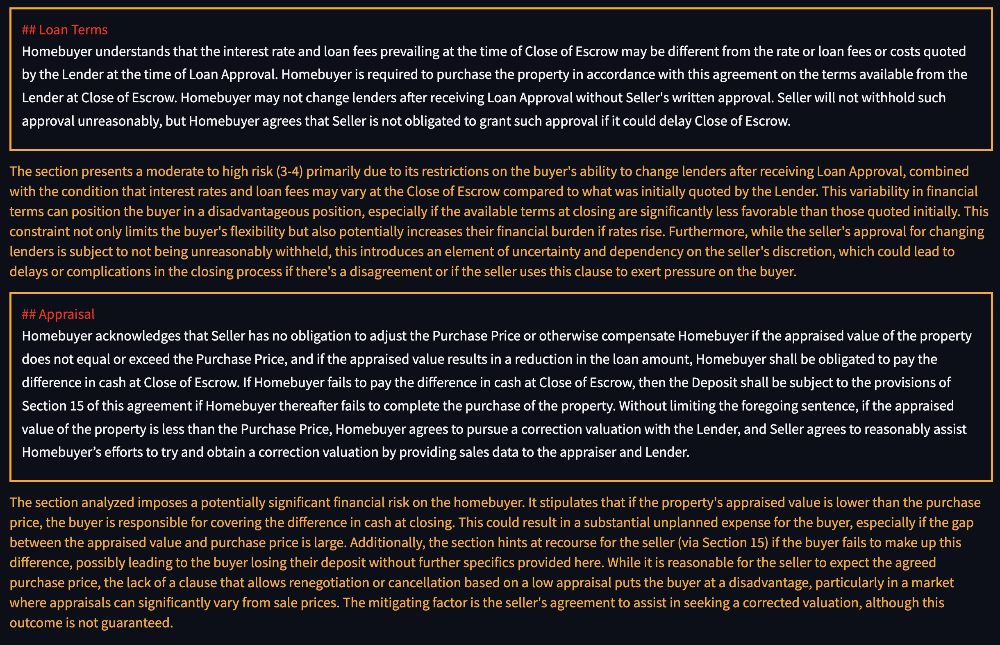

# llm-law-home-safe

This repo contains cleaned code for project "Home Safe" in LLM x Law Hackthon in Stanford.

## Why?

California Association of Realtors have a set of standardized contracts. However, builders may customize the terms for their own benefits. Usually, these terms are only beneficial to the builders, but not the individual home buyers. If you are not aware of these traps, you may pay expensive tuitions (the tuition can be more expensive than going to law school!!!).

This small tool leverages LLM to analyze terms that deviates from the standard templates, and aim to help people buy home safe.

## Design

1. Get the standardized froms from C.A.R, indexing it
2. Upload your purchase agreement
3. We show the identified high risk items that differs a lot from the standard templates

## How to run it

Step 1: Get llama-parse key and openai key and store them in .env. Here's the content of example .env

```
LLAMA_CLOUD_API_KEY=xxxx
OPENAI_API_KEY=yyyy
```

Step 2: Put the standard contract in [standard_contracts](./standard_contracts) and your contract in [custom_contracts](./custom_contracts). The code currently only support 1 standard contract and 1 custom contract. The custom contract must be named as "contract.pdf"

Step 3: run [run_all.sh](./run_all.sh). Each step in the run_all.sh can be ran separately. If you see failure in any of the steps, you don't need to re-ran those succeeded steps.

Step 4: Run `python ui.py` to start the UI. You should expect to see something similar to the screenshot below


